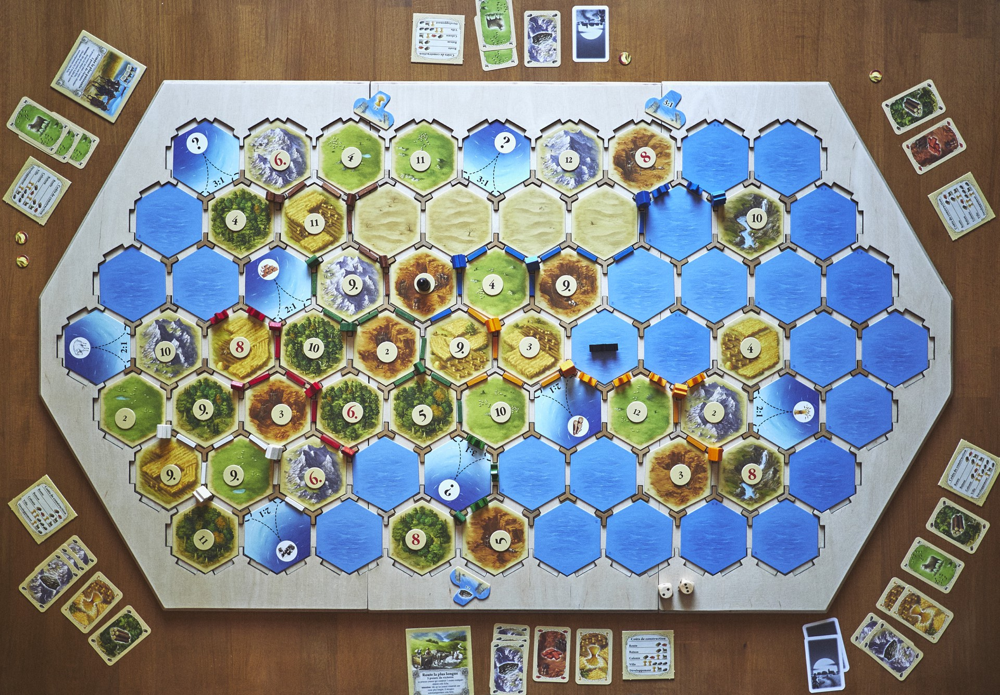
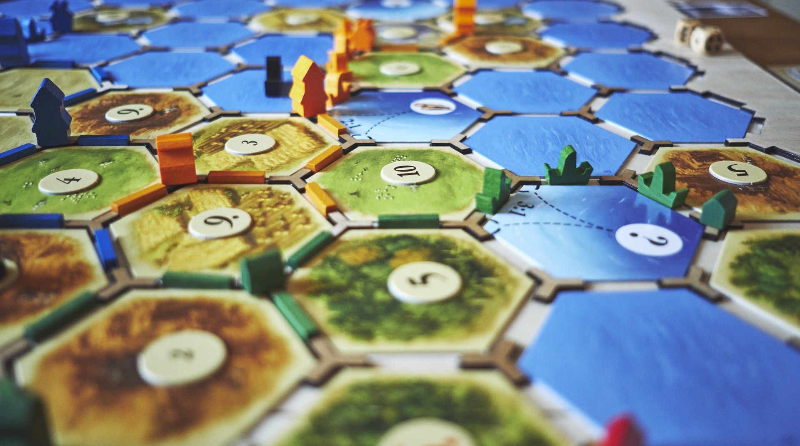

# ⛰ Catan Board

## 🇬🇧 English

**Catan Board** is an Open Source blueprint to create a sweet board for [Catan](http://www.catan.com/). It offers a nice, rock solid and modular playground.

Find the full creation steps on the [dedicated page](./doc/en.md).

#### [📥 Download files](https://github.com/Yago/catan-board/archive/master.zip)

## 🇫🇷 Français

**Catan Board** est un plan Open Source pour créer un plateau pour [Catane](http://fr.asmodee.com/fr/games/catane/). Il offre un espace de solide, beau et modulaire.

Trouvez les étapes complète de montage sur la [page dediée](./doc/fr.md).

#### [📥 Télécharger fichiers](https://github.com/Yago/catan-board/archive/master.zip)

 

