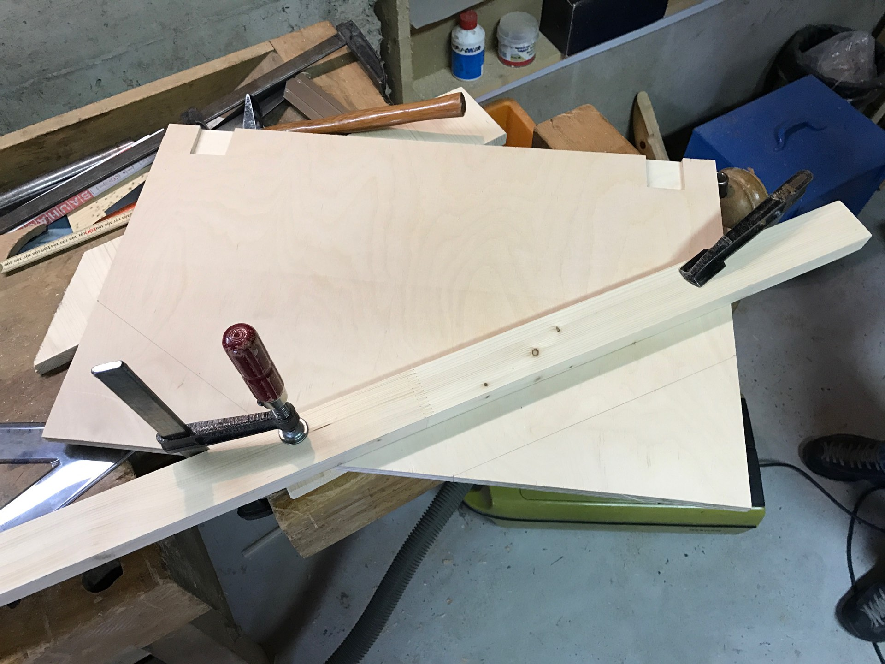

# Catan Board - Creation steps

## Preparation

The board is composed of 3 layers :
- **coastline** (top) : ~4mm, main frame 
- **holes** (bottom) : hexagone center holes
- **base** : solid base to glue everything

You can buy various kinds of material, in my own prototype, I choose birch.

## ️️✂️ Cut

I choose to cut everything on a [Trotec Speedy 300](https://www.troteclaser.com/en/laser-machines/laser-engravers-speedy-series/) in the local Fablab. I you have the same kind of laser-cutting machine or at least a **cutting space of 726mm x 432mm**, juste pick the following file inside `src/inkscape/` :
- `bottom-center.svg` : center frame, **4**mm thick*
- `bottom-left.svg` : left frame, **4**mm thick*
- `bottom-right.svg` : right frame, **4**mm thick*
- `centers.svg` : small pieces to put in holes, **6.5**mm thick*
- `top-center.svg` : center holes, **4**mm thick*
- `top-left.svg` : left holes, **4**mm thick*
- `top-right.svg` : right holes, **4**mm thick*

*\* you can vary the thickness*

You can also pick the **Illustrators** files and made your own exports 😉

You can also **remove a bit of the base** if you want an attachment system.

When everything is cutted, you can **sand your material** for more smoothness.

## 🍯 Glue

First, you have to glue your **holes (bottom) on the base**

...then, the **small pieces in the holes**

... and finally the **frame (top) on the holes (bottom)**

Depending on your glue, you have to **press both part together** during a certain amount of time.

## ✨ Fine tuning

You have to cut with a saw around the frame depending on the amount you want to keep to reduce the board size and have a nice shape.

Finally, I recommend to apply some kind of **varnish** of your choice to protect your board.

